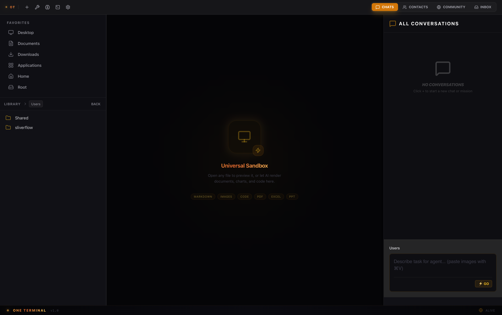
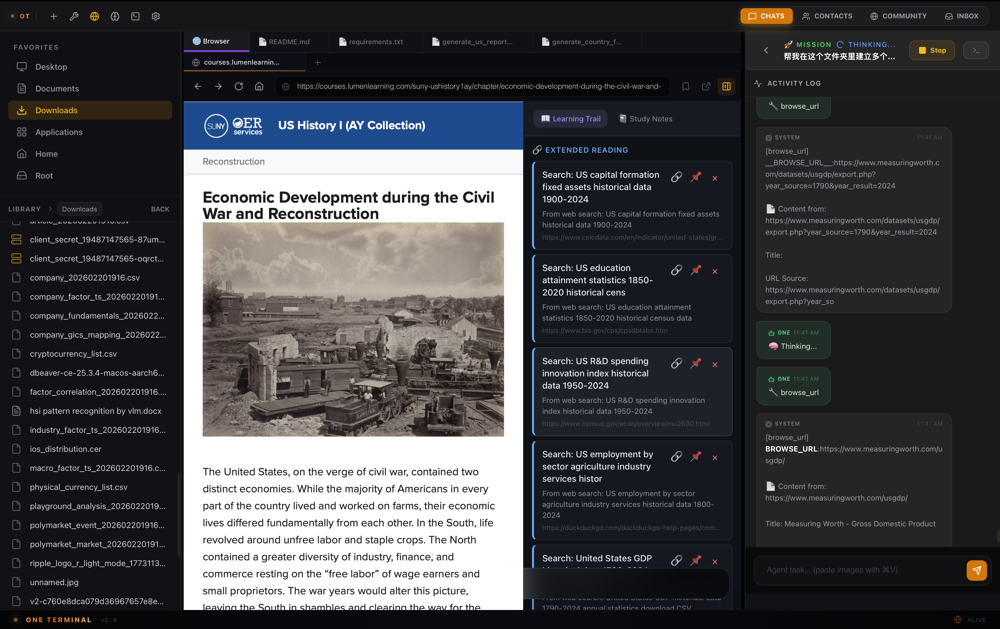
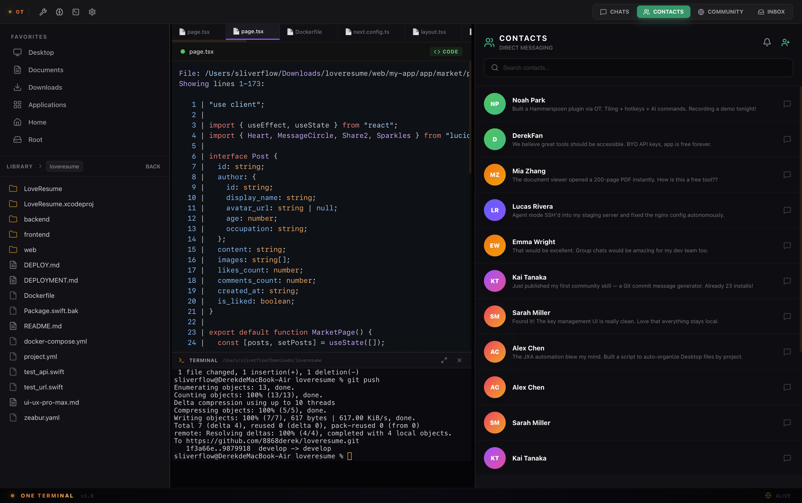
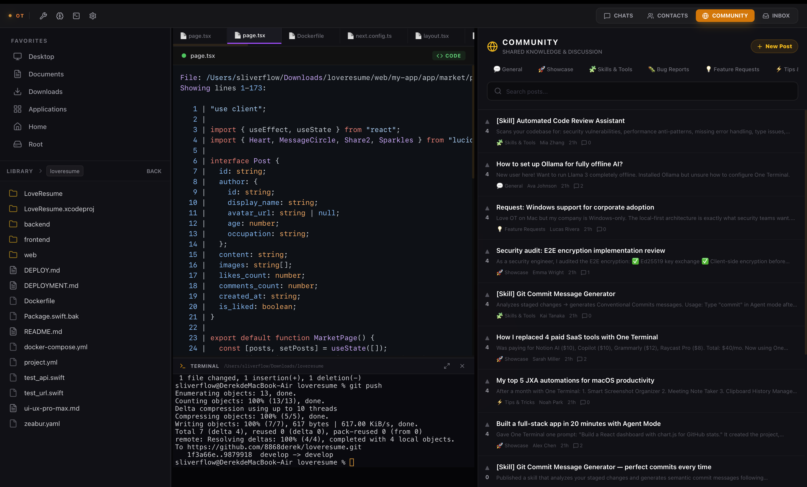

<div align="center">


# One Terminal

### Multimodal AI Production Terminal

**One window. All productivity.**

Text, code, images, video — configure once, produce instantly.

[](https://oterminal-web.zeabur.app/api/download)
[](https://oterminal-web.zeabur.app)
[](https://oterminal-web.zeabur.app/community)

---

[English](#features) · [中文](#功能特性)

</div>

<br />

<div align="center">



</div>

<br />

## What is One Terminal?

One Terminal is a **native macOS desktop app** that turns AI into a real production tool — not just a chatbot. 

Give it a task; it reads files, writes code, runs commands, searches the web, generates images, and delivers results. It's a **multimodal AI agent** that actually gets things done.

### Not another AI chat wrapper.

Most AI tools are glorified chat windows. One Terminal is different:

- 🧠 **Agent Mode** — Give it a goal, it autonomously plans and executes: reads your codebase, writes code, runs tests, iterates until done
- 💬 **Chat Mode** — When you just want to talk, it's there too
- 📁 **Workspace-aware** — Understands your project structure, files, and context
- 🔧 **30+ built-in tools** — File I/O, shell commands, web search, image analysis, and more
- 🔌 **Extensible** — Create custom tools, skills, and specialist agents
- 🏢 **Enterprise-ready** — Connect to [Zero Terminal](https://oterminal-web.zeabur.app) for team task dispatch

<br />

## Features

### 🎯 Multimodal Production Line

<table>
<tr>
<td width="25%" align="center"><strong>✍️ Text</strong><br/><sub>Copywriting, docs, reports — from idea to final draft</sub></td>
<td width="25%" align="center"><strong>💻 Code</strong><br/><sub>Read/write code, run commands, debug — full-stack dev</sub></td>
<td width="25%" align="center"><strong>🖼 Image</strong><br/><sub>AI generation, screenshot analysis, design assets</sub></td>
<td width="25%" align="center"><strong>🎬 Video</strong><br/><sub>Scripts, subtitles, editing automation</sub></td>
</tr>
</table>

### ⚡ How It Works

| Step | What happens |
|------|-------------|
| **01 — Chat or Command** | Chat mode for conversation, Agent mode for tasks. OT figures out the approach. |
| **02 — Action, Not Talk** | Read files, write code, run commands, search the web — say what, get it done. |
| **03 — Gets Smarter** | Knowledge vault auto-accumulates. Project docs auto-update. Every task makes OT smarter. |
| **04 — Enterprise Sync** | Connect Zero Terminal — CEO dispatches tasks → OT auto-executes → results sync in real-time. |

<br />

<div align="center">


<sub><strong>Agent Mode</strong> — Autonomous execution: read files, write code, run commands, plan & track</sub>

</div>

<br />

### 🧠 Learning Trail — You Get Smarter Too

AI's real value isn't doing work for you — it's making **you** smarter with every interaction.

- **📖 Learning Trail** — Every theory, data source, and reference the Agent uses — auto-tagged, auto-recorded
- **📓 Study Notes** — Pin valuable references, add your notes. What the Agent teaches stays with you
- **🧠 Compound Cognition** — Every task teaches you something new. Not a productivity tool — a knowledge partner

<div align="center">



</div>

<br />

### 🔒 Privacy First

- All data stored **locally on your machine**
- Bring your own API keys — no middleman
- No cloud dependency, no tracking
- E2E encrypted messaging between contacts

### 👥 Built-in Community & Messaging

<div align="center">


&nbsp;&nbsp;


</div>

<br />

## Architecture

One Terminal is built with:

- **Frontend**: React + TypeScript
- **Backend**: Rust (Tauri v2)
- **AI Orchestrator**: Custom agent loop with context management, tool execution, and multi-agent delegation
- **Database**: SQLite (local)
- **Messaging**: WebSocket (real-time, ephemeral)

### Core Engine

```
User Input → Orchestrator → Agent Loop → Tool Execution → Result
                ↑                              ↓
          Context Management          30+ Tools (parallel + serial)
          (micro/full compaction)     (hooks, sandboxing, git tracking)
```

Key capabilities of the orchestrator:
- **Context Management**: Automatic micro-compaction and LLM-based checkpoint compaction
- **Tool Execution**: 4-phase pipeline (pre-process → parallel readonly → serial write → delegation)
- **Multi-Agent**: Specialist agents with parallel delegation via `tokio::spawn`
- **AST-aware Editing**: tree-sitter fallback for code edits (Rust, JS/TS, Python, Go)
- **Git Integration**: Auto-checkpoint per iteration, task completion tags
- **LSP Integration**: Multi-language diagnostics and code intelligence
- **Hook Pipeline**: Security audit + workspace isolation + result truncation

<br />

## Pricing

| | Individual | Enterprise |
|---|---|---|
| **Price** | **$0** — Free forever | Custom pricing |
| AI capabilities | ✅ All (bring your API key) | ✅ All |
| Multimodal: text/code/image/video | ✅ | ✅ |
| Auto-learning knowledge vault | ✅ | ✅ |
| Community plugin sharing | ✅ | ✅ |
| Real-time messaging | ✅ | ✅ |
| Zero Terminal admin dashboard | — | ✅ |
| CEO → team task dispatch | — | ✅ |
| Team output tracking & reports | — | ✅ |
| Measurable ROI dashboard | — | ✅ |

<br />

## Download

<div align="center">

### [⬇️ Download for macOS (Apple Silicon)](https://oterminal-web.zeabur.app/api/download)

macOS 12+ · Apple Silicon (M1/M2/M3/M4) · ~15MB

</div>

<br />

## Community

- 💬 [**Discussions**](https://github.com/8868derek/oneterminal/discussions) — Ask questions, share workflows, request features
- 🐛 [**Issues**](https://github.com/8868derek/oneterminal/issues) — Report bugs
- 🌐 [**Web Community**](https://oterminal-web.zeabur.app/community) — Share skills, discover plugins

<br />

## License

One Terminal is **proprietary software**. Free for individual use. See [LICENSE](LICENSE) for details.

<br />

---

<div align="center">

<sub>© 2025 Beijing Ape Tail Technology Co., Ltd. All rights reserved.</sub>

<br />

**[Website](https://oterminal-web.zeabur.app)** · **[Download](https://oterminal-web.zeabur.app/api/download)** · **[Community](https://oterminal-web.zeabur.app/community)**

</div>

---

<br />

<a name="功能特性"></a>

## 中文介绍

### One Terminal · 小莓 🍓

**一个窗口，全部生产力。**

不是又一个 AI 聊天框，而是你的**多模态 AI 生产终端**。

文字、代码、图片、视频 — 配好即用，协同即产出。

### 核心能力

| 模态 | 描述 |
|------|------|
| ✍️ **文字** | 文案撰写、文档生成、报告输出 — 从创意到终稿一步完成 |
| 💻 **代码** | 读写代码、运行命令、调试修复 — 全栈开发即刻交付 |
| 🖼 **图片** | AI 生成、截图分析、设计素材 — 视觉内容随需而生 |
| 🎬 **视频** | 脚本、字幕、剪辑自动化 — 多媒体生产全链覆盖 |

### 有小莓，莓问题 🍓

- **01 — 对话或指令**：Chat 模式随便聊，Agent 模式下达任务。小莓自动判断该怎么做
- **02 — 行动，不废话**：读文件、写代码、跑命令、搜网页 — 你说做什么，它直接做完交付
- **03 — 越用越聪明**：知识库自动积累经验，项目文档自动更新。每一次任务都让小莓更懂你
- **04 — 企业协同就绪**：连接 Zero Terminal，CEO 下发任务 → 小莓自动执行 → 结果实时回传

### 定价

- **个人版**：¥0，永久免费。自带 API Key，无订阅，无追踪，数据不出本地
- **企业版**：按需定价。连接 Zero Terminal 获得团队协同、任务派发、产出追踪、ROI 仪表盘

### [⬇️ 下载 macOS 版](https://oterminal-web.zeabur.app/api/download)