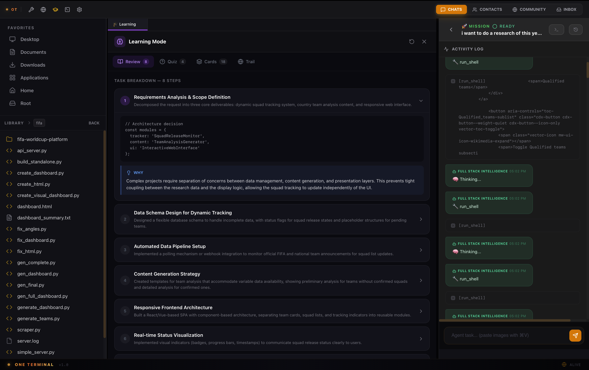
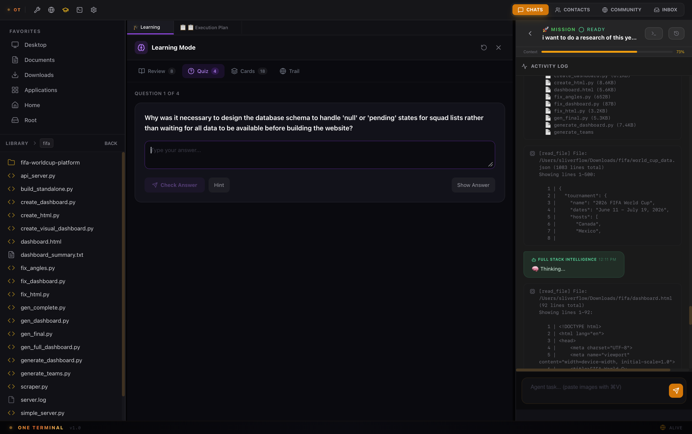
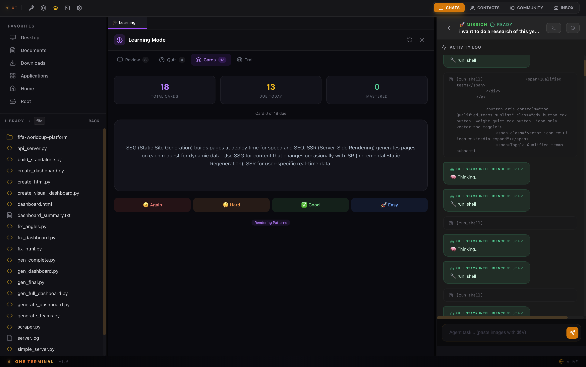

# One Terminal

### Multimodal AI Production Terminal

**One window. All productivity.**

Text, code, images, video — configure once, produce instantly.

---

**English** · [简体中文](README.zh-CN.md)

 

 

## What is One Terminal?

One Terminal is a **native macOS desktop app** built for people who want AI to **actually produce results** — not just answer questions.

Give it a goal. It reads your codebase, writes code, runs commands, searches the web, generates images, and delivers finished work. Then it **remembers what it learned** and shares knowledge with your team.

---

## Three Core Pillars

### 🔧 Swiss Army Knife
Not just a coding IDE. Word, Excel, PPT, video, images — all your daily tasks covered. One person does the work of four.

**Capabilities:**
- 📝 **Text & Docs** — Write reports, revise contracts, summarize meeting notes — Word, PDF, Markdown all supported
- 💻 **Code** — Read/write code, run commands, debug — full-stack dev delivered instantly
- 🎨 **Image** — AI generation, screenshot analysis, PPT design assets — visuals on demand
- 🎬 **Video** — Scripts, subtitles, editing automation — full multimedia pipeline
- 📊 **Data** — Excel analysis, data cleaning, chart generation — handle spreadsheets with natural language
- ⚡ **Daily Tasks** — Schedule planning, file organization, format conversion — hand off busywork to AI

<strong>Agent Mode</strong> — Autonomous execution: read files, write code, run commands, plan & track

---

### 🧠 Learn by Doing
The biggest value of LLMs is helping you learn new things. Every task auto-generates reviews, quizzes, and flashcards — not to do the work for you, but to make you stronger.

**Learning Trail features:**

| Feature | Description |
|---------|-------------|
| 📋 **Step Review** | Auto-generated review of *why* each step was taken, not just *what* was done |
| 🧪 **Interactive Quiz** | Thought-provoking questions testing understanding, not memorization |
| 🃏 **Flashcards** | Spaced-repetition cards for key concepts, Anki-style |
| 🔄 **Incremental Sync** | Detects new conversation content; only regenerates when there's something new |

 

  

 

| Step Review | Interactive Quiz | Flashcards |
|:-:|:-:|:-:|
|  |  |  |

---

### 💬 Light Social
Built-in community and messaging, but not a social platform. Share PPT tricks, useful MCPs, troubleshoot AI issues — all centered around the tool and productivity.

- 🔐 **E2E Encrypted Messaging** — Messages deleted from server on delivery. No traces, no tracking.
- 🌐 **Community Space** — Share workflows, discover plugins, discuss best practices. Centered on productivity, not socializing.

 

  
  &nbsp;&nbsp;
  

---

## Privacy First

- All data stored **locally on your machine**
- Bring your own API keys — no middleman, no subscription
- No cloud dependency, no tracking, no telemetry
- Messages: E2E encrypted, deleted on delivery

---

## Quick Start

1. **Download** from the [website](https://oterminal-web.zeabur.app/api/download) (macOS, Apple Silicon)
2. **Add your API key** — Settings → Keys → Add (supports OpenRouter, DeepSeek, OpenAI, Anthropic, 302.AI, and 10+ Chinese providers)
3. **Start a mission** — Describe your goal in natural language and let the Agent handle the rest

---

## Tech Stack

Built with **Rust** (Tauri v2) + **React** + **SQLite**. Key internals:
- **4-phase tool pipeline**: pre-process → parallel readonly → serial write → multi-agent delegation
- **AST-aware editing**: tree-sitter fallback for Rust, JS/TS, Python, Go
- **Git integration**: auto-checkpoint per iteration, task completion tags
- **LSP integration**: multi-language diagnostics and code intelligence
- **Context management**: automatic compaction with model-specific thresholds

---

## Pricing

| Feature | Individual | Enterprise |
|---|---|---|
| **Price** | **$0** — Free forever | Custom pricing |
| Multimodal production | ✅ Text, code, image, video | ✅ |
| Auto-learning knowledge vault | ✅ | ✅ |
| Community & plugin sharing | ✅ | ✅ |
| Encrypted real-time messaging | ✅ | ✅ |
| Zero Terminal admin dashboard | — | ✅ |
| CEO → team task dispatch | — | ✅ |
| Team output tracking & reports | — | ✅ |

---

## License

One Terminal is **proprietary software**. Free for individual use. See [LICENSE](LICENSE) for details.

 

© 2025-2026 Beijing Ape Tail Technology Co., Ltd. All rights reserved.

